# MRF2 User Manual

**Firmware version:** 10.7.0

This manual covers how to operate the MRF2 firmware user interface, including the on-device displays, buttons, calibration flow, and film counter behavior. It is written for everyday use, not just for builders.

## Contents

- [First-time setup (recommended order)](#first-time-setup-recommended-order)
- [Quick start (after initial setup)](#quick-start-after-initial-setup)
- [Controls](#controls)
- [Displays and status LED](#displays-and-status-led)
- [Main screen](#main-screen)
  - [Portrait leveling](#portrait-leveling)
  - [Distance readouts](#distance-readouts)
  - [LiDAR quality indicator](#lidar-quality-indicator)
  - [Light meter / shutter speed](#light-meter--shutter-speed)
  - [How to focus](#how-to-focus)
- [Setup menus](#setup-menus)
  - [Setup root menu](#setup-root-menu)
  - [Film submenu](#film-submenu)
  - [Lens Settings submenu](#lens-settings-submenu)
  - [Light Meter submenu](#light-meter-submenu)
  - [LiDAR submenu](#lidar-submenu)
  - [Display submenu](#display-submenu)
  - [System Health screen](#system-health-screen)
    - [Factory Reset](#factory-reset)
  - [ISO list](#iso-list)
  - [Film formats](#film-formats)
- [Lens calibration](#lens-calibration)
  - [How it works](#how-it-works)
  - [Before you start](#before-you-start)
  - [Step 1: Select lens](#step-1-select-lens)
  - [Step 2: Capture distance points](#step-2-capture-distance-points)
  - [Distance point sequences](#distance-point-sequences)
  - [Completion](#completion)
- [Reset film counter](#reset-film-counter)
- [External display](#external-display)
- [Sleep mode](#sleep-mode)
- [Default startup settings](#default-startup-settings)
- [Troubleshooting](#troubleshooting)
- [Firmware updates](#firmware-updates)

## First-time setup (recommended order)

If this is your first time using the camera, this sequence keeps things simple and predictable:

1. Make sure the camera is switched off.
2. Mount the lens you plan to use.
3. Load your film, aligning the arrow on the backing paper to the arrow on the top-left edge of the film chamber.
4. Close and secure the film door, then switch on the camera.
5. Long-press **Right (R)** to enter **Setup**, open **Lens >**, then run **Lens Calibration** for the mounted lens.
6. Still in **Setup**, open **Film >** to set frame size, open **Meter >** to set ISO, open **LiDAR >** to set the **Idle timeout**, then open **Display >** to set your preferred **Sleep timeout** and horizon trim values.
7. From **Setup > Film**, select **Reset frame counter >>** so the frame counter starts at zero.
8. Use the **advance lever** to wind to frame 1. This takes a little while. Power through!

## Quick start (after initial setup)

1. Power on the camera. The main display shows an "Initialising..." progress bar with a label naming each peripheral group as it starts up, the external display plays a short film-advance animation that carries the firmware version into view, and then the main UI appears.
2. Check the **main screen** for ISO, aperture, shutter speed, LiDAR distance, LiDAR quality blocks, and lens distance.
3. Long-press **Right (R)** for 3 seconds to enter **Setup** and make changes.
4. Use the **advance lever** to move the film; the external display shows the frame counter and progress bar.

## Controls

- **Left button (L)**
  - Short press (< 1s): on the main screen, cycles apertures downward through the selected lens; in menus, moves to the next item.
- **Right button (R)**
  - Short press (< 1s): on the main screen, cycles apertures upward through the selected lens; in menus, selects or confirms the highlighted item.
  - Long press (>= 3s): enters Setup from the main screen.
- **Advance lever**
  - Used for film advance tracking. Each lever stroke increments the film counter and updates the progress bar.

## Displays and status LED

- **Main display (128x128)**: primary viewfinder UI.
- **External display (128x32)**: format, lens, battery, film counter, progress bar, and sleep text.
- **NeoPixel status LED**
  - Blue: no frame progress detected yet.
  - Red -> green gradient: progress between frames.
  - Violet: "Load film." or "Roll end."
  - Off: sleep mode.

## Main screen

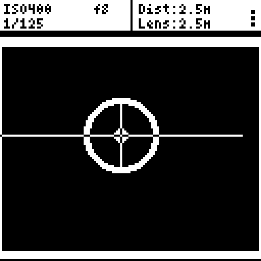

The main screen displays:

- **ISO** (upper left)
- **Aperture** (upper center-left)
- **Shutter speed** (lower left)
- **LiDAR distance** (upper right, labeled "Dist") — a small sun glyph appears just before the quality blocks when ambient infrared is high enough to degrade the LiDAR (e.g. shooting horizontally toward bright sky in full sun). The reading may be less reliable while the glyph is visible; expect occasional drop-outs or slightly wider noise.
- **LiDAR quality indicator** (4 small squares in a vertical stack at the right edge of the status bar)
- **Lens distance** (lower right, labeled "Lens")
- **Framelines** scaled to the selected film format
- **Reticle and focus ring**
- **Level line** (horizon aid)
- **Adaptive orientation leveling** (landscape and portrait)

### Portrait leveling

When the camera is rotated to portrait orientation, the level aid automatically rebases to portrait behavior.
You can tune horizon trim offsets independently for **Landscape**, **Portrait+**, and **Portrait-** in **Setup > Display > Horizon trim >**.

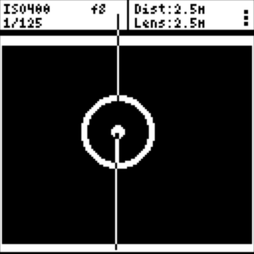

### Distance readouts

**LiDAR distance (Dist)** is the measured distance to whatever the sensor is aimed at. It uses primary and secondary returns with confidence scoring and a correction curve for stable readings. Confidence accounts for ambient sunlight relative to return strength; thresholds are tuned for bright outdoor use, and the sensor falls back to low-confidence tracking at all ranges when a return is rejected. Measurement range is 5 cm to 18 m.

Normal numeric readings are formatted by distance:

| Distance | Shown as | Example |
| --- | --- | --- |
| Below 1 m | centimetres | `75cm` |
| 1 m to below 2 m | metres, two decimals | `1.85m` |
| 2 m and above | metres, one decimal | `2.5m` |

The readout also uses these special states:

| Readout | What it means | What to do |
| --- | --- | --- |
| `Inf.` | Measured reading above 18 m, the display's infinity cutoff (the sensor is rated to 20 m). | Use the lens barrel markings; set the ring to ∞. |
| `Inf?` | Signal lost while the last reading was beyond 3 m — usually aimed at sky or something too far or dark to return a pulse. A guess, not a measurement. | Use the lens barrel markings. |
| `...` | No valid data for 1 second at close range. | Check LiDAR wiring/power, or try a different target angle. |
| `Zzz` | LiDAR is in idle standby. | Focus or press a button to wake it. |
| `<15cm` | A near reading below the display threshold. | Move back if you need an exact figure. |
| `Held:` | The last good reading is being held instead of jumping or blanking (see below). | For a beam slip, aim at the farther subject briefly to release it. |

The label reads `Held:` instead of `Dist:` in two cases. First, when the lens is focused close and the LiDAR briefly reports something much farther away — usually the beam slipping past your subject onto the background. Second, for a moment at the very start of a signal dropout, before the readout falls back to `...` or `Inf?`. In both cases the previous reading is held.

**Lens distance (Lens)** is read from the focus-ring position sensor, using the lens's calibration table. It shows `Inf.` beyond the calibrated infinity threshold, and `--.-` when the mounted lens has not been calibrated (the readout is inactive until you calibrate it).

### LiDAR quality indicator

The four tiny squares at the right edge of the top status bar show return quality for the currently selected LiDAR reading:

- **1 square**: Poor
- **2 squares**: Fair
- **3 squares**: Good
- **4 squares**: Excellent

When no valid recent LiDAR data is available (`Dist: ...` or `Dist: Inf?`) or LiDAR is in idle standby (`Dist: Zzz`), the quality indicator clears.

### Light meter / shutter speed

The light meter always runs in **aperture-priority** mode: you choose the aperture (via L/R in normal operation), and the firmware suggests a shutter speed.

The firmware uses the BH1750 light meter, ISO, and aperture to compute shutter speed:

- Shows `Bright!` if the computed speed is too fast.
- Shows `Dark!` if light level is near zero.
- Otherwise shows a shutter speed like `1/125 sec.` or `1.3 sec.`

### How to focus

The MRF2 gives you two independent distance readouts — **LiDAR distance** (measured to the subject) and **Lens distance** (read from the focus ring position) — plus a visual **focus ring** that shows how well they agree. Together they let you focus quickly and confirm accuracy without a split-image or ground-glass screen.

#### Basic workflow

1. **Point the camera at your subject.** The LiDAR distance appears in the top-right corner of the main screen (e.g. `2.5m`). The quality indicator shows how confident the reading is.
2. **Turn the focus ring** until the Lens distance (bottom-right) matches the LiDAR distance. As the two readings converge the focus ring shrinks toward the reticle.
3. **When the ring is at its smallest**, the lens is focused at the measured distance. Compose and shoot.

#### Reading the focus ring

The focus ring is a circle drawn around the centre reticle. Its size and thickness tell you how far off focus you are:

- **Large ring** — the lens is focused far from the subject. Keep turning.
- **Small, thin ring** — the lens and LiDAR distances are close. You are in focus or very near it.
- **Minimum size (tight dot)** — the two distances match within 5 cm. Focus is confirmed.

The ring radius is based on the difference between the LiDAR distance and the lens distance, compared in 5 cm steps and clamped to the display area. The thickness scales with the radius so it stays visible at all sizes.

#### Tips

- **Use the LiDAR number first, then fine-tune with the ring.** Glance at the `Dist` readout to get a ballpark, dial the focus ring close, then watch the ring shrink for the last adjustment.
- **Calibrate your lens** before relying on Lens distance. Without calibration the Lens readout is inactive and the ring defaults to maximum size. See [Lens calibration](#lens-calibration).
- **In bright sunlight** the LiDAR may occasionally lose signal. The last valid reading is held for 1 second, so brief dropouts are hidden. When the signal is lost beyond 3 m the display switches to `Inf?`. If `...` persists at close range, check wiring or try a different target angle.
- **At infinity** the Lens readout shows `Inf.` and the LiDAR readout shows `Inf.` above 18 m (the display's infinity cutoff; the sensor itself is rated to 20 m), or `Inf?` when far-range signal is lost. The focus ring is irrelevant at infinity — just set the ring to the ∞ mark.
- **Parallax correction** shifts the framelines based on focus distance. Keep it enabled (default) for accurate framing at close range. It has no effect at infinity.

## Setup menus

Enter Setup by **long-pressing Right (R)** from the main screen.

### Setup root menu

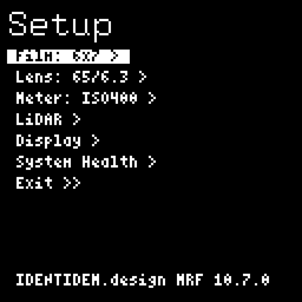

**Navigation rules**

- **L short press**: move to the next menu item.
- **R short press**: change the highlighted value or enter the selected submenu.

**Setup root items**

1. **Film: _format_ >**: opens film submenu. Shows the active film format (e.g. `6x7`).
2. **Lens: _name_ >**: opens lens submenu. Shows the active lens (e.g. `65/6.3`).
3. **Meter: ISO_value_ >**: opens light meter submenu. Shows the active ISO (e.g. `ISO400`).
4. **LiDAR >**: opens LiDAR submenu (distance offset + idle timeout).
5. **Display >**: opens display submenu (brightness, horizon, sleep, reticle).
6. **System Health >**: opens diagnostics screen.
7. **Exit >>**: return to the main screen.

The footer at the bottom of this screen shows `IDENTIDEM.design MRF` followed by the firmware version — the quickest way to read your version if a maintainer asks.

### Film submenu

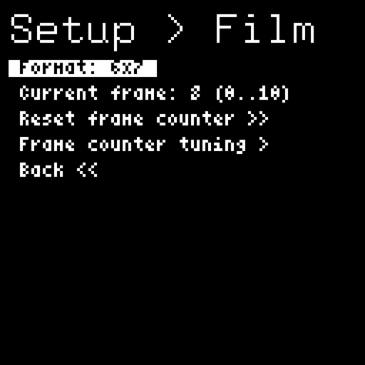

The header reads **Setup > Film** so you always know where you are.

1. **Format**: cycles film formats.
2. **Current frame**: manually set frame counter for the selected format.
3. **Reset frame counter >>**: confirm film counter reset.
4. **Frame counter tuning >**: enter the frame-counter fine-tuning sub-page (offset and spacing — rarely needed once a format is dialled in).
5. **Back <<**: return to setup root menu.

#### Frame counter tuning sub-page

1. **Frame 1 offset**: shifts where frame 1 starts (`-10` to `+10`, default `0`).
2. **Frame spacing**: adjusts spacing between frames (`-10` to `+10`, default `0`).
3. **Back <<**: return to the Film submenu.

Current frame ranges are format-bound:

- **PANO**: `0..20`
- **3x6**: `0..21`
- **6x4.5**: `0..16`
- **6x6**: `0..12`
- **6x7**: `0..10`
- **9x3**: `0..8`
- **6x9**: `0..8`

### Lens Settings submenu

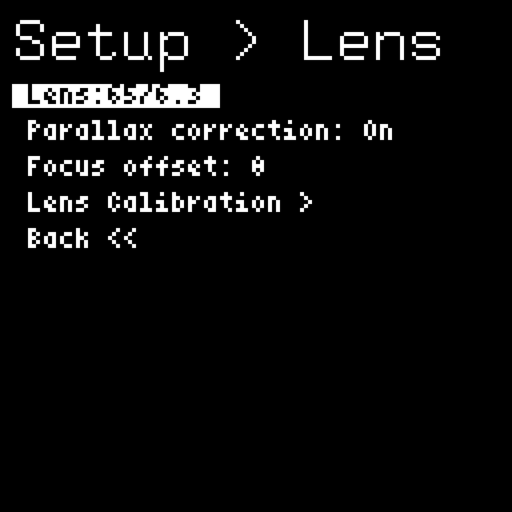

1. **Lens**: cycles calibrated lenses only.
2. **Parallax correction**: toggle on/off.
3. **Focus offset**: per-camera focus fine-tune in ADC counts (`-25` to `+25`, default `0`), applied in Main mode only. Aligns the distance readout without a full recalibration; the stored calibration table is unchanged.
4. **Lens Calibration >**: enter calibration workflow.
5. **Back <<**: return to setup root menu.

### Light Meter submenu

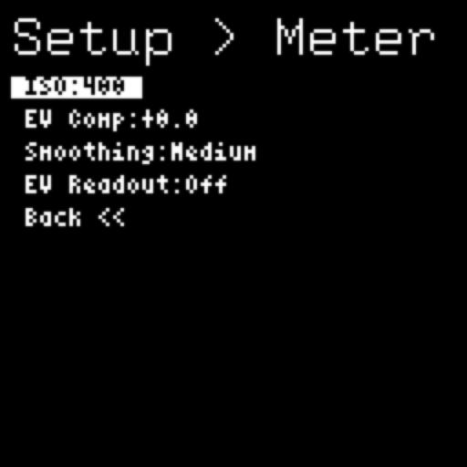

1. **ISO**: cycles ISO values.
2. **EV Comp**: adjust exposure compensation in 1/3-stop steps, up to +/-3 EV.
3. **Smoothing**: cycles `Off`, `Low`, `Medium`, `High`.
4. **EV Readout**: toggle the EV value on the main screen. When on, the shutter field switches to a compact form and appends the metered EV (for example `1/125 EV12.0`); the value reads `EV--.-` when no EV is available.
5. **Back <<**: return to setup root menu.

### LiDAR submenu

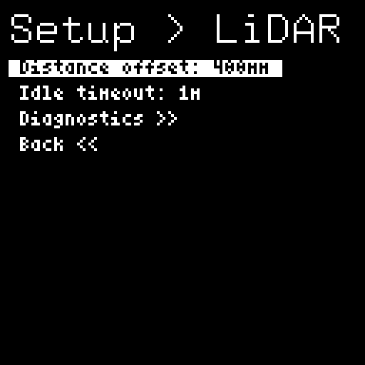

1. **Distance offset**: cycles the LiDAR distance correction in `10mm` steps from `0mm` to `800mm` (default `400mm`). Compensates for the physical offset between the LiDAR sensor and the lens plane so the displayed distance matches reality. Tune by aiming at a target a known distance away (e.g. a tape measure at 1.00m) and adjusting until the **Dist** readout on the main screen agrees. Changes take effect immediately — no reboot needed.
2. **Idle timeout**: cycles `Off`, `15s`, `30sec`, `1m`, `1m30s`, `2m` (default `1m`). Time of no measured-distance change before the LiDAR enters its low-power standby.
3. **Diagnostics >>**: opens a live telemetry screen for troubleshooting LiDAR range and lock problems (see below).
4. **Back <<**: return to setup root menu.

#### LiDAR Diagnostics screen

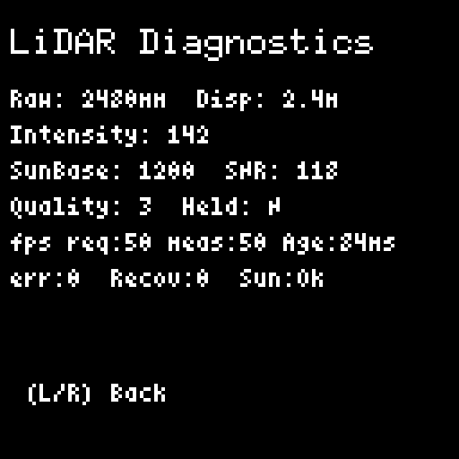

Aim the camera at a target and read back exactly what the sensor reports, frame by frame. Use this when the LiDAR will not lock or seems short-ranged, and when reporting a problem so a maintainer has real numbers to work from. Press either button to return.

- **Raw** — the sensor's reported distance in millimetres. This already includes your **Offset** setting (the sensor library adds it before reporting), but not the camera's near-range correction curve. When comparing Raw values between two cameras, make sure both use the same Offset. **Disp** is what the main screen would show.
- **Intensity** — strength of the returned pulse. Low intensity at distance means little light is coming back (dark or distant subject).
- **SunBase / SNR** — the ambient infrared baseline and the signal-to-noise ratio (in permille). High SunBase with low SNR is bright-light interference.
- **Quality** — the sensor's own quality grade, 0 (none) to 4 (excellent).
- **Held** — `Y` when the plausibility gate is holding the reading because it overshot the lens focus distance (see the `Held:` note above).
- **fps req / act** — the frame rate the firmware requested versus what the sensor reported back. A lower frame rate gives the sensor longer to integrate, which can extend range.
- **Age** — how long ago the values on this screen were captured. Normally a few tens of milliseconds; a climbing Age means the sensor has stopped producing frames and everything above is stale. `--` means no frame has arrived since boot.
- **err / Recov / Sun** — last sensor error code, recovery count, and the high-sunlight flag.

If you can read close objects but never distant ones — especially outdoors — see [Troubleshooting](#troubleshooting); this is often a sensor power-supply issue with a documented hardware fix.

### Display submenu

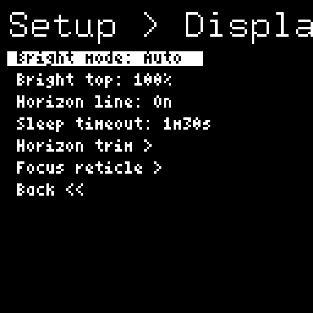

1. **Bright mode**: display brightness mode (`Auto` scales with ambient light from the light meter; `Manual` sets a fixed level; default `Auto`).
2. **Bright top** (if Auto): maximum brightness ceiling (`50%`–`100%` in `10%` steps, default `100%`). Displayed as **Bright level** if Manual: fixed brightness (`5%`–`100%` in `5%` steps, default `100%`).
3. **Horizon line**: toggle the horizon/level indicator on the main viewfinder screen (`On`/`Off`, default `On`).
4. **Sleep timeout**: cycles `Off`, `15s`, `30sec`, `1m`, `1m30s`, `2m` (default `1m30s`).
5. **Horizon trim >**: enter horizon-trim sub-page (independent landscape and portrait offsets).
6. **Focus reticle >**: enter visual reticle offset adjustment (see below).
7. **Back <<**: return to setup root menu.

#### Horizon trim sub-page

1. **Landscape**: landscape trim offset (`-30deg` to `+30deg`, `2.5deg` steps, default `0deg`).
2. **Portrait+**: portrait trim offset for one portrait side (`-30deg` to `+30deg`, `2.5deg` steps, default `0deg`).
3. **Portrait-**: portrait trim offset for the opposite portrait side (`-30deg` to `+30deg`, `2.5deg` steps, default `0deg`).
4. **Back <<**: return to the Display submenu.

#### Focus reticle adjustment

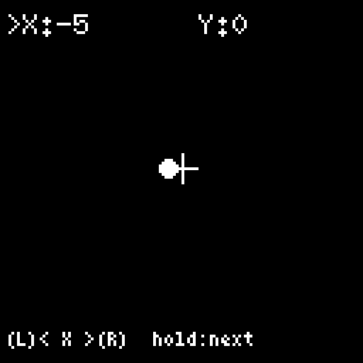

This screen lets you visually align the focus reticle to the camera's optical centre. The current X/Y offsets are shown at the top with a `>` marker on the active axis. A small reference crosshair marks the unmodified centre so you can see how far the dot has moved; the dot snaps onto the crosshair when both offsets are zero.

1. **Horizontal**: press **L** to move left, **R** to move right. **Long press either button** to advance to vertical adjustment.
2. **Vertical**: press **L** to move up, **R** to move down. **Long press either button** to save the new offsets and return to the Display submenu.

Offsets are stored in non-volatile memory and survive reboots. Range: -20 to +20 pixels in each axis. The factory default is X = -5, Y = 0.

##### Calibrating the reticle position

The LiDAR emits an infrared (IR) laser dot that you can't see with the naked eye but most digital cameras can. Use this to align the on-screen reticle with where the LiDAR is actually pointing:

1. Set up a focus target with a clear centre mark (e.g. a printed crosshair or "+") at a few metres' distance.
2. Aim the camera so the LiDAR dot lands on the centre of the focus target. View the IR dot through a phone camera or any digital camera without an IR-cut filter — most front-facing phone cameras work; some rear cameras filter IR too aggressively to see it.
3. With the IR dot held on the target centre, enter **Setup > Display > Focus reticle >** and adjust the on-screen reticle until it sits over the same point on the camera's view as the IR dot.
4. Long-press to save.

Only do this if the reticle and LiDAR dot disagree noticeably; the factory default offset is usually close enough for most users.

### System Health screen

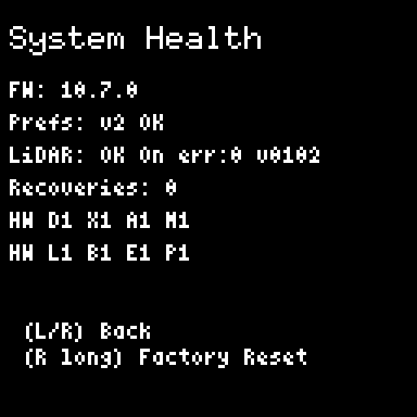

Shows quick diagnostics:

- Firmware version (`FW`)
- Preferences schema status (`Prefs`), one of:
  - `Ok` — settings loaded cleanly at the current schema.
  - `Defaults` — no saved settings were found, so factory defaults are in use.
  - `Legacy migrated` — older settings were found and upgraded to the current schema.
  - `vN newer` — the saved settings came from a newer firmware than the one now running (you flashed an older build). Settings load best-effort; reflash the newer firmware or factory-reset if anything looks wrong.
- LiDAR sensor and enabled status, plus last error code
- LiDAR recovery count
- Hardware peripheral flags — `1` = ready, `0` = not detected:
  - `D` main display, `X` external display, `A` lens ADC (ADS1015), `M` accelerometer (MPU6050)
  - `L` light meter (BH1750), `B` battery gauge (MAX17048), `E` encoder, `P` status pixel

Controls:

- **L**: return to Setup.
- **R short**: if LiDAR failed to initialise (`InitErr`), re-attempts LiDAR initialisation without a power cycle. Otherwise returns to Setup.
- **R long** (3s): enters the **Factory Reset** confirmation screen (see below).

#### Factory Reset

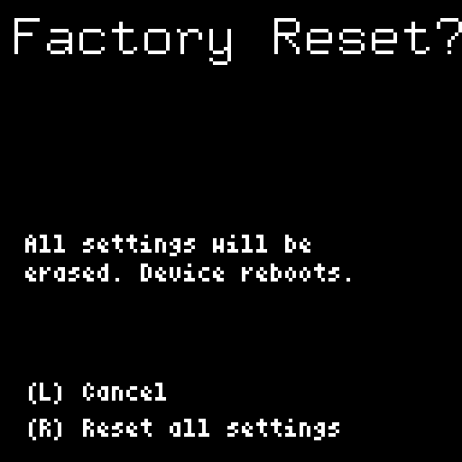

Reached by long-pressing **R** on the System Health screen. Confirming clears all saved settings — lens calibrations, film counter, ISO, sleep timeouts, and the rest — and reboots the device with defaults. This is useful for troubleshooting corrupted preferences or preparing the camera for a new user.

- **L**: cancel and return to System Health.
- **R**: confirm the reset and reboot with defaults.

### ISO list

Available ISO values:

- 50, 80, 100, 125, 200, 400, 500, 640, 800, 1600, 3200, 6400

### Film formats

- PANO (65 x 24)
- 3x6 (30 x 56)
- 6x4.5 (42 x 56)
- 6x6 (56 x 56)
- 6x7 (70 x 56)
- 9x3 (90 x 30)
- 6x9 (84 x 56)

## Lens calibration

Calibration teaches the MRF2 how the physical position of your lens's focus ring maps to real-world focus distances. An analog position sensor reads where the ring sits, and calibration records a series of sensor values at known distance markings. Once calibrated, the firmware interpolates between these points to display real-time focus distance and drive the focus-ring indicator on the main screen.

### How it works

Each lens has a set of distance markers engraved on its focus ring (for example, 1 m, 1.2 m, 1.5 m, 2 m, 3 m, 5 m, 10 m). During calibration, you physically turn the focus ring to each marked distance in order from closest to farthest and press a button to capture the sensor reading at that position. The readings must increase monotonically — each point must produce a higher sensor value than the last — because the ring moves in one direction from near to far.

After all points are captured, the MRF2 saves a lookup table pairing sensor values to distances. During normal use, it reads the sensor, finds where the current value falls in the table, and interpolates the corresponding distance. This is what appears as the **Lens distance** readout and what sizes the focus ring in the viewfinder.

### Before you start

- Mount the lens you want to calibrate.
- Make sure the focus ring moves freely and the position sensor cable is connected.
- Know where the distance markings are on your lens barrel.

### Step 1: Select lens

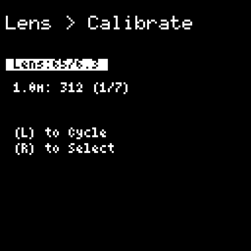

Navigate to **Setup > Lens > Lens Calibration**. The calibration screen shows the currently selected lens.

- **L**: cycle through available lenses
- **R**: confirm lens selection and begin capture

### Step 2: Capture distance points

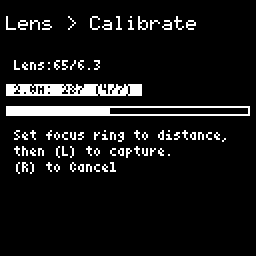

The screen shows the target distance, the live sensor reading, and a progress counter (e.g. "3/7"). A full-width progress bar beneath the distance line tracks how many points have been captured.

For each target distance:

1. Turn the lens focus ring until it aligns with the distance marking on the lens barrel.
2. Hold the ring steady.
3. Press **L** to capture. The LED flashes green to confirm a successful reading.

When the final point is captured, a full-screen success message is shown and the LED pulses green three times. The message is held for 1.5 seconds before returning to the Lens settings menu with the calibrated lens selected.

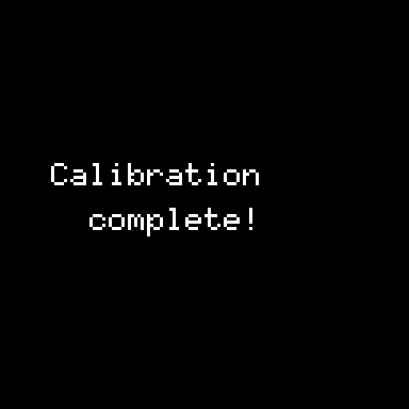

If a capture fails, the screen shows a specific error and holds it for at least 2 seconds so you can read it:

- **"Unstable reading / Hold lens still and retry"** — the sensor values varied too much during sampling. Keep the ring stationary and press **L** again.
- **"Out of sequence / Increase focus distance"** — the new reading was not higher than the previous one. The focus ring must move progressively from near to far. Turn it further towards infinity and retry.
- **"Readings decreasing / Sensor wired backward?"** — the sensor value moved the wrong way as you turned towards infinity, which usually means the position-sensor wiring is reversed. Check the sensor cable orientation before retrying.

Controls during capture:

- **L**: capture current reading and advance to the next distance
- **R**: cancel calibration and return to **Setup > Lens**

### Distance point sequences

Distance points are lens-specific. The calibration UI shows the exact sequence for the selected lens:

- **Default** (50/6.3, 65/6.3, 75/5.6, 90/3.5, 100/3.5, 100/2.8, 127/4.7): **1, 1.2, 1.5, 2, 3, 5, 10 m**
- **150/5.6**: **2, 2.5, 3, 5, 10 m**
- **250/5.0**: **2.5, 4, 5, 7, 8, 10, 15, 20, 30, 50 m**
- **250/8.0**: **3.5, 4, 5, 7, 10, 15, 20, 30, 50 m**

### Completion

When all distances are captured, the lens is automatically marked as calibrated, the calibration data is saved to preferences, and you return to the Lens Settings menu. The lens is now selectable from the main Lens picker and its distance readout is active on the main screen.

## Reset film counter

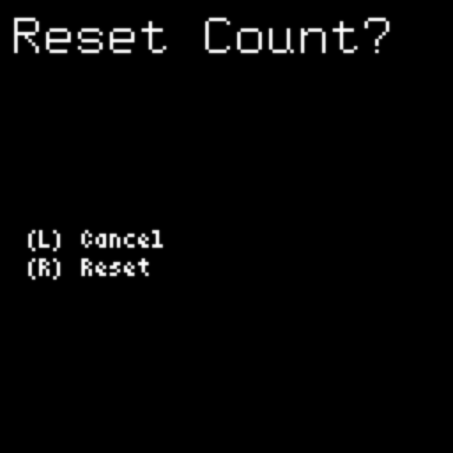

- **L**: cancel
- **R**: reset the film counter and return to the main screen

## External display

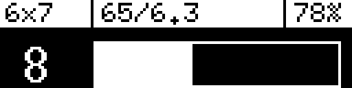

The external display shows:

- **Header:** format, lens, battery percentage
- **Progress bar:** advance progress between frames
- **Counter:** frame number, "Load film.", or "Roll end."

### Counter behaviors

- **Load film.** appears when the counter is at 0 and film needs advancing to frame 1.
- **Roll end.** appears when the whole film is on the take-up spool and _should_ be safe to remove.
- **Numeric counter** appears for frame one to last frame.

## Sleep mode

In Main mode, LiDAR enters low-power standby after the configured **LiDAR idle timeout** period (default **1 minute**) and wakes automatically on user activity. While idle standby is active, the main display shows `Dist: Zzz`.

After the configured **Sleep timeout** period of inactivity (default **1 minute 30 seconds**, set in **Setup > Display >**), the firmware enters sleep mode:

- Main display fades to black over ~200 ms, then powers off.
- LiDAR turns off.
- External display shows a sleeping face graphic.
- Status LED is off.

Wake the device by pressing any button or moving the lens/advance lever (any activity resets the sleep timer).

## Default startup settings

- ISO: **400**
- Format: **6x7**
- Lens: **65/6.3** (pre-calibrated)
- Parallax correction: **On**
- Sleep timeout: **1m30s**
- LiDAR idle timeout: **1m**

## Troubleshooting

The `Dist` readouts `Inf.`, `Inf?`, `...`, `Zzz`, and `<15cm` are normal states, not faults — see the [distance readouts table](#distance-readouts) for what each means and what to do. The problems below are the ones worth chasing:

| Symptom | Likely cause | Fix |
| --- | --- | --- |
| LiDAR only reads close objects — nothing at distance, worse outdoors or in bright light | The pulsed laser briefly starves its 3.3 V rail because the connector has no local decoupling capacitor. Confirm in **Setup > LiDAR > Diagnostics**: distant target shows very low Intensity and Quality 0–1 while SunBase is high. | Apply the [LiDAR power decoupling errata](../hardware-errata/lidar-stage1-decoupling.md). To gather data for a maintainer first, follow the [field test protocol](../hardware-errata/lidar-field-test.md). |
| LiDAR quality stays at 1 square (Poor) | Low subject reflectivity, a glancing angle, or bright ambient interference. Low-SNR returns in strong sun are accepted at lower confidence and update more slowly. | Face the subject more squarely, choose a more reflective target, or shade the shot. |
| Shutter speed reads `Bright!` or `Dark!` | The computed speed is off the ends of the meter's range for the current ISO and aperture. | Adjust ISO and/or aperture. If it never changes, verify the light meter sensor on the Health screen. |
| Lens option does not show your lens | Only calibrated lenses are selectable. | Run [Lens calibration](#lens-calibration) for that lens first. |
| Film counter does not increment | The advance lever is not registering strokes. | Verify the advance-lever mechanism and that each stroke is detected (watch the progress bar on the external display). |

## Firmware updates

### Browser updater

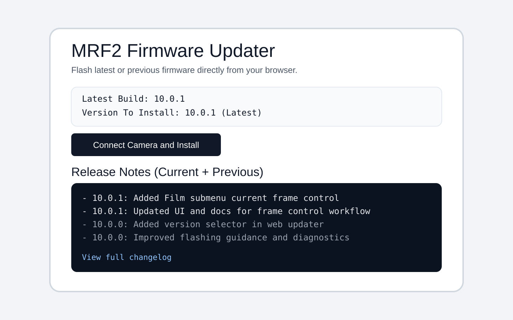

- Open `https://update.mrf2.com/` in desktop Chrome or Edge.
- **Version To Install** defaults to the latest published firmware.
- **Release Notes (Current + Previous)** shows notes for the selected version and the version immediately before it.
- Use **View full changelog** for complete details.

### VS Code / PlatformIO method

For local flashing or development workflows, see `Documentation/flash-firmware/README.md` in the repo root.
